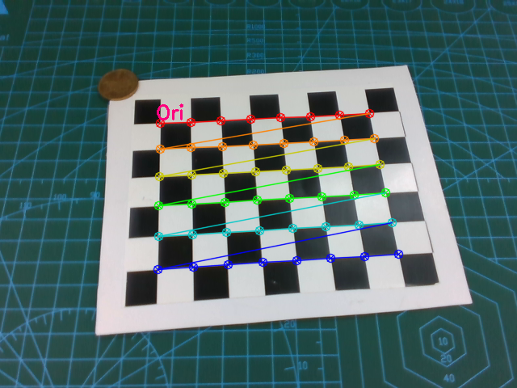
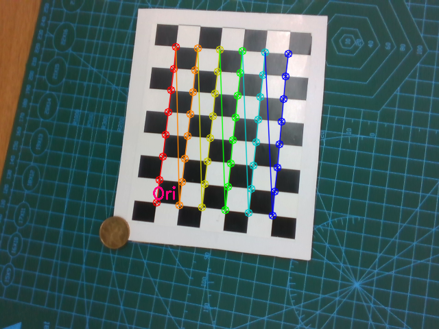
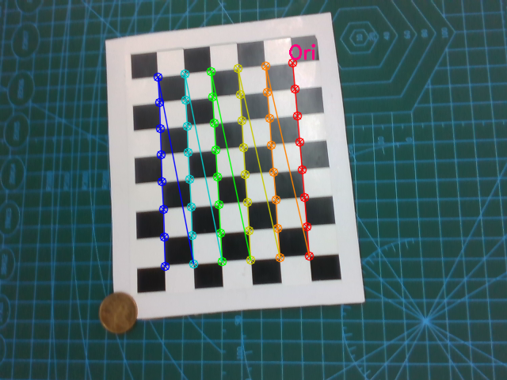

# 相机标定总结

相机内外参标定，手眼标定的原理。
<!--more-->
# 1. 内外参标定
## 1.1 棋盘格
棋盘格上包含有 $n\times m\ (n \neq m)$ 个点，定义世界坐标系 $O_w$ 建立在棋盘格左上角点，且以棋盘格平面作为 $x-y$ 平面。
因此，每个格点的世界坐标也被定义。


由于棋盘格中心对称，因此并没有绝对的左上角点。实际操作时，以相机拍摄的图片为准。

如图所示，设置 `pattern_shape = (8, 6)`，调用 `cv2.findChessboardCorners`，会找到一条射线满足：(1) 其上有 8 个角点；(2) 射线角度范围为 $(-\pi, \pi)$。
以该条射线的起始点为坐标原点。因此，以五毛硬币为参考，坐标原点 $O_w$ 的位置发生了变化。
<div>
    
    
    
</div>
随着相机位姿的改变，世界坐标系可能会发生变化，但这不影响相机内参标定：

* 内参：始终表示相机坐标 $O_c$ 到像素坐标 $O_p$ 的变换 $T^{cp}$
* 外参：始终表示世界坐标 $O_w$ 到相机坐标 $O_c$ 的变换 $T^{wc}$，只是世界坐标会发生改变。

但是手眼标定时，需要固定世界坐标与机器人基座坐标的关系，此时需要用非对称棋盘格。




设坐标系 $O_A$ 和 $O_B$ 的基分别为 $\alpha, \beta$。

**（1）** 如何理解 $O_A$ 坐标到 $O_B$ 坐标的变换 $T^{AB}$

在此语境下，$T^{AB}$ 表示一个左乘矩阵，可以将空间中一点 $P$ 在 $O_A$ 中的坐标 $P_A$ 转换为在 $O_B$ 中的坐标 $P_B$，也即 $T^{AB}$ 满足：
$$P_B = T^{AB}P_A$$
$T^{AB}$ 可以这样得到：写出 $\alpha$ 在 $\beta$ 的表示 $\alpha = \beta (\alpha_1^\beta, \alpha_2^\beta, \alpha_3^\beta)$，则有：
$$T^{AB}=(\alpha_1^\beta, \alpha_2^\beta, \alpha_3^\beta)$$

在矩阵理论中，$T^{AB}$ 通常称为：$\beta$ 到 $\alpha$ 的过渡矩阵 $\alpha = \beta T^{AB}$。
若有线性变换 $\sigma$ 将 $\beta$ 基映射为 $\alpha$ 基，则 $\sigma$ 在 $\beta$ 基的矩阵为 $T^{AB}$。

**（2）** 如何做 $O_B$ 到 $O_A$ 的线性变换。

$T^{AB}$ 除了可以转换坐标，还可以做线性变换将 $\beta$ 映射为 $\alpha$，线性变换前后，两个坐标系都没有发生变化，点 $P$ 在 $O_B$ 的坐标从 $P_B$ 变为 $P'_B$。则有：

$$P_B' = T^{AB}P_B$$



## 1.2 给定一张棋盘格图片
给定一张棋盘格图片，可以提取得到每个角点的像素坐标 $P^p_i$，而每个角点的世界坐标已被定义 $P^w_i$ （下标为点的编号，上标为参考系），因此两者一一对应，可以得到 $n\times m$ 组方程：
$$P^p_i = T^{wp}P^w_i$$
可以求出世界坐标到像素坐标的转换矩阵 $T^{wp}$。

## 1.3 给定多张棋盘格图片
每一张图片可以得到一个 $T^{wp}_j$ （$j$ 为图片编号）。而世界坐标到像素坐标的转换矩阵等于内参 $\times$ 外参：
$$T^{wp}_j = T^{cp} T^{wc}_j$$
内参不随着位姿改变，因此不带下标 $j$ 。给定多张图片调用 `cv2.calibrateCamera` 即可求出**内参** $T^{cp}$。进一步可得到每张图片的外参 $T^{wc}_j$。

## 1.4 已知内参 $T^{cp}$ 给定一张棋盘格图片
已知内参 $T^{cp}$，首先求出 $T^{wp}$，然后根据 $T^{wp} = T^{cp} T^{wc}$ 即可求出 $T^{wc}$，也即棋盘格坐标到相机坐标的转换矩阵。
上述算法可以调用 `cv2.solvePnP` 实现。


# 2. 手眼标定
手眼标定要求 $T^{cb}$ 或 $T^{cg}$，也即相机坐标到机器人基座或者末端坐标的转换。其中末端到基座坐标的转换矩阵 $T^{gb}$ 可以从机器人控制器读取到。

## 2.1 相机固定于机器人末端 (eye-in-hand)

坐标变换关系如上图所示，, 图中 `t` 表示 “target”, 与文中 `w` 等价。此时，待求量为相机到机器人末端（gripper）的转换矩阵 $T^{cg}$。固定棋盘格坐标（$O_w$，因此需使用非对称棋盘格）和机器人基座（$O_b$）的位置，则有：

$$ T^{wb} = T^{gb}_j\times T^{cg} \times T^{wc}_j$$

任取两张图片 $1, 2$ 可得：

$$T^{wb} = T^{gb}_1 T^{cg} T^{wc}_1 = T^{gb}_2 T^{cg} T^{wc}_2$$
$$\Rarr (T^{gb}_2)^{-1} T^{gb}_1 \cdot T^{cg}  = T^{cg}\cdot T^{wc}_2(T^{wc}_1)^{-1}$$

因此，问题转换为更为通用的形式：
$$\Rarr A_iX=XB_i$$

具体标定做法为，将非对称棋盘格固定于某处拍摄多张图片，记录每个位姿的 $T^{gb}_j$ 以及 $T^{wc}_j$，然后调用`cv2.calibrateHandEye`[:link:](https://docs.opencv.org/4.5.5/d9/d0c/group__calib3d.html#gaebfc1c9f7434196a374c382abf43439b)。
```python
cv2.calibrateHandEye(R_gripper2base, t_gripper2base, R_target2cam, t_target2cam[, R_cam2gripper[, t_cam2gripper[, method]]]) -> R_cam2gripper, t_cam2gripper
```
其中：

* `R_gripper2base`: [in] 机器人末端到基座坐标的齐次变换矩阵（$T^{gb}$）中的旋转部分 `[img_num, 3, 3]`，可从机器人控制器读取
* `t_gripper2base`: [in] 机器人末端到基座坐标的齐次变换矩阵（$T^{gb}$）中的位移部分 `[img_num, 3, 1]`，可从机器人控制器读取
* `R_target2cam`: [in] 世界坐标（由棋盘格定义）到相机坐标的齐次变换矩阵（$T^{wc}$）中的旋转部分 `[img_num, 3, 3]`，由 `cv2.calibrateCamera` 得到
* `t_target2cam`: [in] 世界坐标（由棋盘格定义）到相机坐标的齐次变换矩阵（$T^{wc}$）中的位移部分 `[img_num, 3, 1]`，由 `cv2.calibrateCamera` 得到
* `R_cam2gripper`: [out] 相机坐标到机器人末端坐标的齐次变换矩阵（$T^{cg}$）中的旋转部分 `[img_num, 3, 3]`
* `t_cam2gripper`: [out] 相机坐标到机器人末端坐标的齐次变换矩阵（$T^{cg}$）中的位移部分 `[img_num, 3, 1]`
* `method`: [in] 标定算法

举个例子：
```python
r_c2g, t_c2g = cv2.calibrateHandEye(g2b[:, :3,:3], g2b[:, :3,3], w2c[:, :3,:3], w2c[:, :3, 3])
```

## 2.1 相机放置于机器人之外 (eye-to-hand)
这种情况下待求量为相机到机器人基座（base）的转换矩阵 $T^{cb}$，因为这个量是固定不变的。
类似 eye-in-hand 问题，需要将棋盘格固定在机器人末端执行器上，也即固定 $T_{wg}$，则有：

$$ T^{wg} = T^{bg}_j\times T^{cb} \times T^{wc}_j$$
其中 $T^{bg} = (T^{gb})^{-1}$，可以从机器人控制器读取再求逆。

同样，任取两张图片 $1, 2$ 可得：

$$T^{wg} = T^{bg}_1 T^{cb} T^{wc}_1 = T^{bg}_2 T^{cb} T^{wc}_2$$
$$\Rarr (T^{bg}_2)^{-1} T^{bg}_1 \cdot T^{cb}  = T^{cg}\cdot T^{wc}_2(T^{wc}_1)^{-1}$$

因此，问题转换为更为通用的形式：
$$\Rarr A_iX=XB_i$$

注意到，该问题与 eye-in-hand 问题唯一的区别是 $T^{gb}$ 修改为了 $T^{bg}$。因此实际操作时，只需要将棋盘格固定在机器人末端执行器上，然后将读取的 $T^{gb}$ 先取逆，然后调用 `cv2.calibrateHandEye` 即可。


